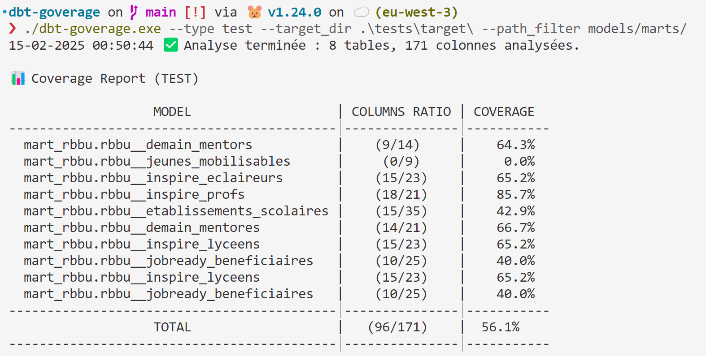

# 🛠️ dbt-goverage

**dbt-goverage** est un outil écrit en **Go** permettant d'analyser la couverture documentaire et de tests des bases de données gérées par **dbt** (Data Build Tool). Il génère un rapport JSON indiquant quelles colonnes sont documentées ou testées et calcule un taux de couverture global.

## 🚀 Fonctionnalités

- Analyse la **couverture documentaire** (`description` non vide dans `manifest.json`).
- Analyse la **couverture des tests** (`test` non vide dans `manifest.json`).
- Génère un **rapport JSON** avec les statistiques par table et le taux de couverture global.
- Peut être exécuté sur **Windows, macOS et Linux**.
- **Contrairement à `dbt-coverage`, ne fait pas (et ne fera pas) de comparaisons de builds.**

---

## 📦 Installation

### 1️⃣ **Cloner le projet**
```sh
 git clone https://github.com/mickaelandrieu/dbt-goverage.git
 cd dbt-goverage
```

### 2️⃣ **Compiler le projet**

#### 🔹 Linux/macOS

```sh
go build -o dbt-goverage
```
#### 🔹 Windows

```sh
go build -o dbt-goverage.exe
```

### 3️⃣ **Exécuter l'outil**

```sh
./dbt-goverage --target_dir . --type doc --output coverage_doc.json
```

> ⚠️ Assurez-vous que `dbt` a généré les fichiers `manifest.json` et `catalog.json` dans le répertoire `target/`.

---

## 📌 Utilisation

### **Commande Principale**

Si vous l'utilisez à la racine d'un projet dbt, alors la commande est très simple.

```sh
./dbt-goverage
```

### **Principaux Arguments**
| Argument           | Type   | Description |
|--------------------|--------|-------------|
| `--target_dir `   | string | 📁 Répertoire contenant les fichiers `manifest.json` et `catalog.json`. *(Par défaut : `target`)* |
| `--type`          | string | 🔍 Type de couverture à analyser (`doc` pour documentation, `test` pour tests). *(Par défaut : `test`)* |
| `--output`        | string | 📂 Chemin du fichier JSON de sortie. *(Par défaut : `coverage_report.json`)* |

### **Exemples**

#### **Analyse de la documentation**

```sh
./dbt-goverage --project_dir . --type doc --output coverage_doc.json
```

#### **Analyse des tests**
```sh
./dbt-goverage --project_dir . --type test --output coverage_test.json
```
#### **Personnalisation du répertoire et du fichier de sortie**
```sh
./dbt-goverage --project_dir /data/dbt_project --type doc --output /reports/doc_coverage.json
```

---

## **Exemple de sortie JSON**

```json
{
  "cov_type": "doc",
  "covered": 137,
  "total": 171,
  "coverage": 0.8011695906432749,
  "tables": [
    {
      "name": "model.dbt_project__name.model__name",
      "covered": 17,
      "total": 23,
      "coverage": 0.7391304347826086,
      "columns": [
        {
          "name": "column1__name",
          "covered": 1,
          "total": 1,
          "coverage": 1
        },
        {
          "name": "column2__name",
          "covered": 0,
          "total": 1,
          "coverage": 0
        },
      ]
    }
  ]
}
```

## **Exemple de sortie Console**



---

## 🤝 Contribution
Les contributions sont les bienvenues ! Clonez le repo, créez une branche et ouvrez une **Pull Request** 🚀.

---

## 📜 Licence
Ce projet est sous licence **MIT**.
Voir le fichier `LICENSE` pour plus d’informations.